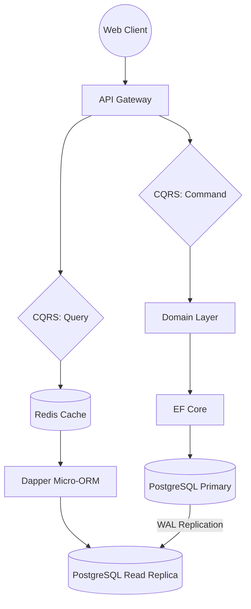

## The Problem

The client, a mid-sized e-commerce operation, had outgrown their off-the-shelf CRM system. Data synchronization was taking too long, database deadlocks were causing sporadic 502 errors during peak load, and feature development had ground to a halt due to crippling technical debt. The business required an alternative that was fast, strongly typed, and entirely owned by them.

## The Solution

I designed and implemented a bespoke CMS and CRM engine from scratch using **.NET 8** and **Clean Architecture** principles. Rather than relying on heavyweight ORMs for everything, I utilized Dapper for high-performance read projections while keeping Entity Framework Core strictly for bounded write operations. 

Here is a high-level view of the decoupled architecture:



### Core Implementation Details

The system heavily leverages the **Mediator pattern** to decouple the HTTP transport layer from the business logic. 

```csharp
[ApiController]
[Route("api/customers")]
public class CustomerController : ControllerBase
{
    private readonly IMediator _mediator;

    public CustomerController(IMediator mediator) => _mediator = mediator;

    [HttpPost]
    public async Task<IActionResult> CreateCustomer([FromBody] CreateCustomerCommand command)
    {
        var result = await _mediator.Send(command);
        return result.IsSuccess ? Ok(result.Value) : BadRequest(result.Errors);
    }
}
```

By isolating the domain, we achieved 100% unit-test coverage on the business rules.

## Results

*   **Performance**: Time To First Byte (TTFB) decreased from 1.2s to 85ms on the 95th percentile.
*   **Reliability**: Extinguished all database deadlocks by separating read and write pathways.
*   **Velocity**: The client's internal team can now implement requested features in days instead of weeks.

The system is now processing over 50,000 transactions daily seamlessly.
